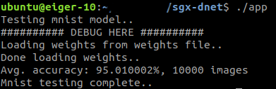
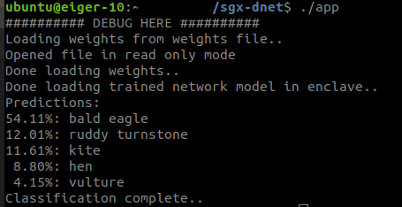

## Summary
- `sgx-dnet` is a port of the machine learning library [Darknet](http://pjreddie.com/darknet) into Intel SGX. 
- This library can be used to securely train and test neural networks models as well as perform inference on pre-trained models following the Darknet API. 
- `sgx-dnet` source is separated into two main parts: `dnet-in` (Enclave/dnet-in) and `dnet-out` (App/dnet-out). `dnet-in`contains all the necessary API to do secure training and inference within the enclave runtime, without any I/O functionality or system calls, and the `dnet-out` acts as a support library for the `dnet-in` and complements any unsupported enclave functionality.
- Both parts communicate via ecalls and ocalls when/where necessary. 
- We redefine unsupported I/O calls like `fread, fwrite` etc, which act as wrapper functions for ocalls which invoke the corresponding `libc` routines in the untrusted runtime. These wrappers are mainly used for checkpointing and reading weights to/from disk respectively.
- For performance reasons, other I/O functionality like reading training data and network config files are performed completely outside; developers using `sgx-dnet` should design their code in such a way that any non-sensitive input data is read into untrusted memory before proceeding into the enclave for training and inference. This style minimizes unecessary and expensive I/O during training or inference. For scenarios where training or inference data is to be kept private, the above mentioned wrapper functions could still be exploited.
- OPenCV functionality and video processing are not supported as of now. Future versions may take those into account.

 

## Training a model
- To train a model, add a routine in `App.cpp` similar to the example cifar trainer: `train_mnist`. 
- Create a corresponding trainer routine in the trusted side which will be called via the `ecall_trainer` ecall.
- Read and parse the model config file into a `list` data structure in the untrusted runtime. 
- Read the training data into the global `training_data` object/variable.
- Perform an ecall with the list and training data objects; the secure training routine is performed within the ecall.
- Modify `Trainer.edl` or `Enclave.edl` accordingly if you need to add more e/ocalls.
- To test the mnist training and testing, download the 4 mnist training and test data and labels here:[mnist data](http://yann.lecun.com/exdb/mnist/), decompress the files and add them to the `App/dnet-out/data/mnist` folder before launching the training and test routines.
- See the example trainer with the mnist model for more inspiration on how to train and test other models.

## Saving/Checkpointing networks during training
- Network weights can be saved to disk during training via the `save_weights(net,path)` API. 
- This routine leverages the file i/o wrappers described above.
 

## Testing the model
- To test the model after training, add a routine in `App.cpp` which takes the test data as input.
- Add a test routine in the enclave/trusted section which performs inference on a trained `network` object. This object could reside in enclave memory or be created from a weights file.
- Perform an ecall into the enclave runtime with the test data, and run your test routine within the enclave.
- Sample output: testing trained mnist model.

## Doing inference
- By providing a weight file and corresponding labels, you can perform inference on a pre-trained network model.
- The tiny darknet classification example shows how to classify images using a pre-trained network.
- The trained model weights can be obtained via: `wget https://pjreddie.com/media/files/tiny.weights`. Copy these weights to the `Apps/dnet-out/backup` folder and modify the corresponding path to the weights file in [trainer.c](Enclave/dnet-in/train/trainer.c). Equally modify the paths to the corresponding config file and test image in [App.cpp](App/App.cpp).
- Run the `test_tiny` routine in the main function.
- Sample top5 prediction on the `eagle` image: 

## Debug hints
- The `sgx-gdb` debug tool is recommended for debugging your enclave application.
- In case you have "strange" `seg faults`, your neural network may be too large to fit in the enclave heap.
- Try increasing the enclave heap size i.e the `HeapMaxSize` parameter in the enclave config file. It is `4GB` (0x100000000) by default in this project.

## Note
- All CUDA functionality is disabled/stripped off in `dnet-in` because GPUs do not have access to enclave memory.
- The secure `dnet-in` library contributes approximately `2MB` to the total enclave size after build.

For questions or issues regarding `sgx-dnet` please contact me: `xxxxxx@gmail.com`. 

# Darknet #
Darknet is an open source neural network framework written in C and CUDA. It is fast, easy to install, and supports CPU and GPU computation.

For more information see the [Darknet project website](http://pjreddie.com/darknet).

